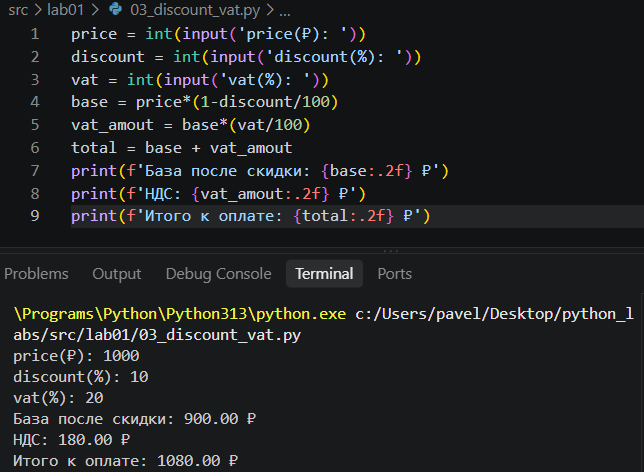
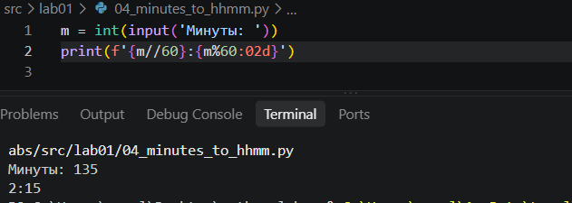

# Задание 1 
Вот так сделала

# Задание 2
 Вводим два числа, заменяем запятые на точки.Считаем сумму и ср знач. Выводим, указываем точность до 2 знака после запятой.

 

# Задание 3
Вводим числа, формулы, выводим ответ до 2 знака после заяптой.

# Задание 4
Вводим число, выводим целое число часов, остаток- минуты.

