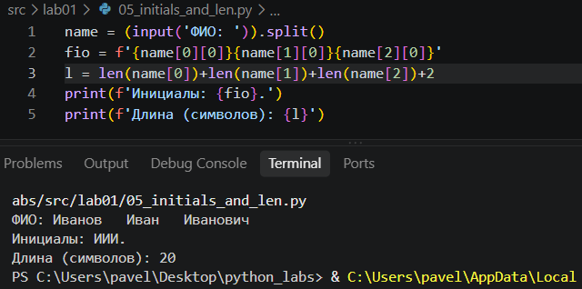
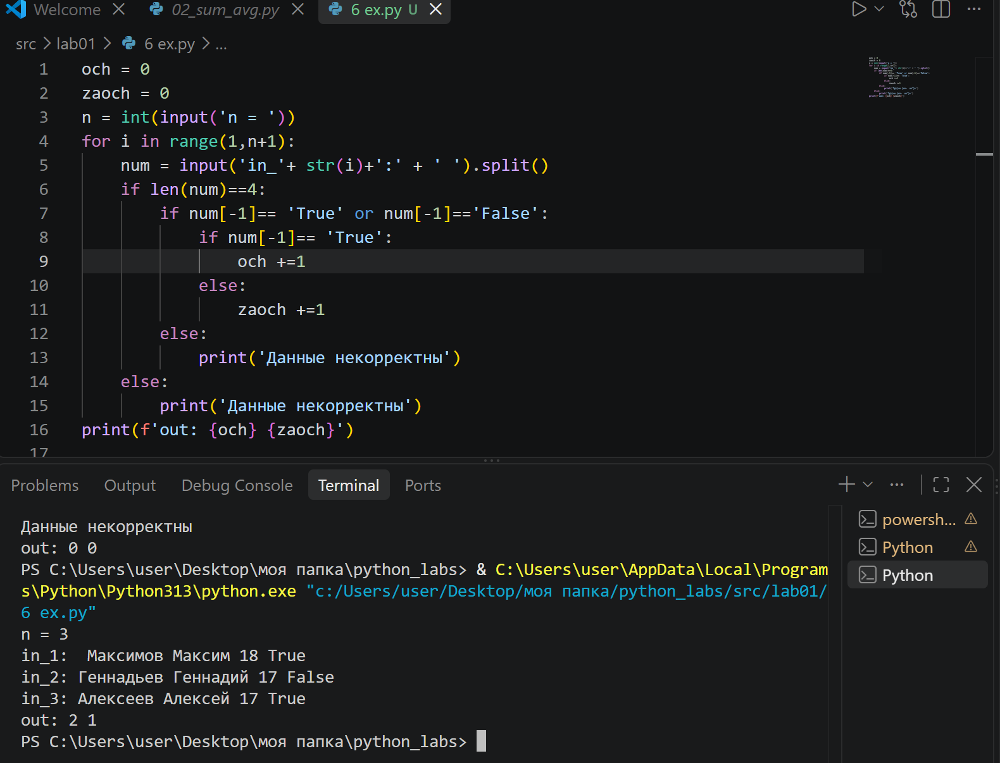
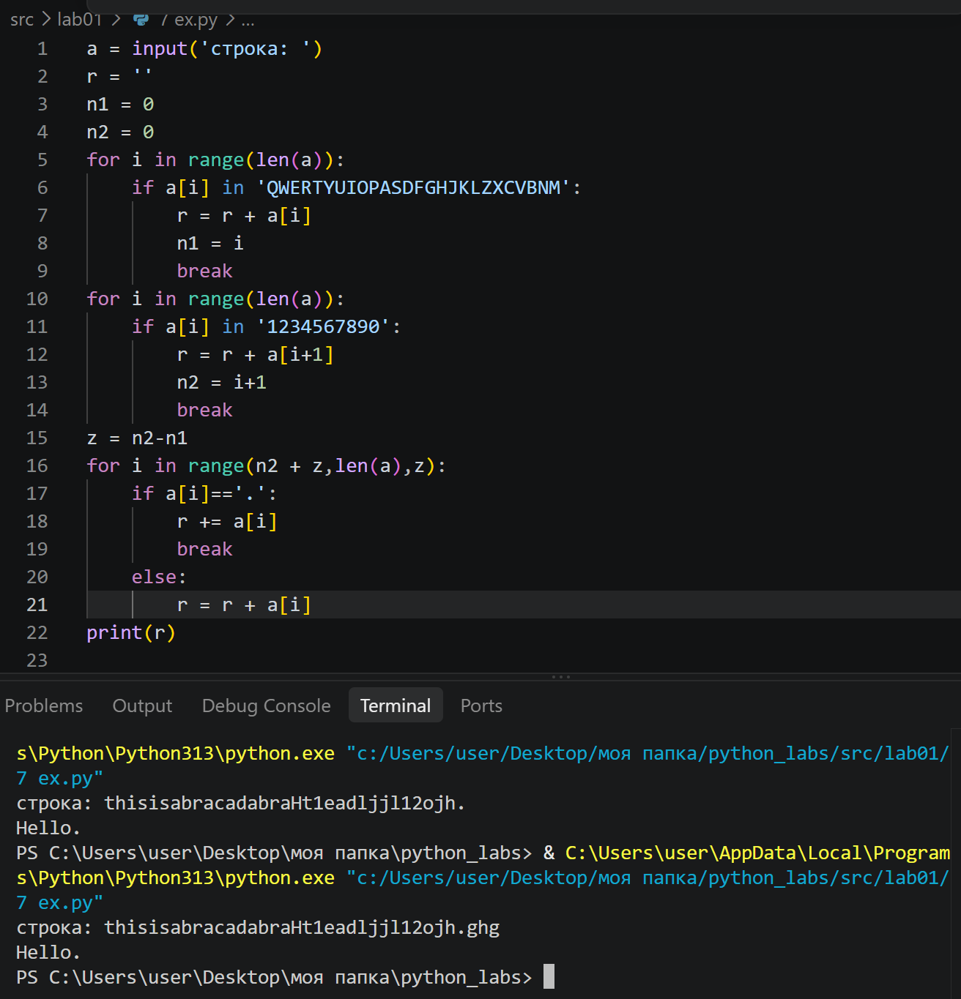

# Задание 1 
Вот так сделала

# Задание 2
 Вводим два числа, заменяем запятые на точки.Считаем сумму и ср знач. Выводим, указываем точность до 2 знака после запятой.

 

# Задание 3
Вводим числа, формулы, выводим ответ до 2 знака после заяптой.

# Задание 4
Вводим число, выводим целое число часов, остаток- минуты.

# Задание 5
Вводим фио, разделяем, берем первые буквы каждого куска, получаем инициалы. Считаем длину каждого куска, добавляем 2 нужных пробела, получаем длину строки.

# Задание 6
Заводим счетчики, вводим число n. Вводим in_ n раз, разделяем сплитом. Проверяем что длинна списка 4 и последний элемент True или False, если нет говорим что данные некорректны. Если все хорошо смотрим на послений элемент и увеличиваем счетчик. Выводим результат.

# Задание 7
ВВодим строку, заводим переменную для новой строки, заводим n1 и n2 для индексов. Идем по строке и ищем заглавную букву, когда найдена, добавляем в новую строку и заканчиваем цикл. Также ищем цифру и берем следующий элемент. Найденные индексы записываем в n1 и n2. Ищем шаг. Идем по строке начиная с последнего найденого эл + шаг до конца строки. Делем проверку на точку. выводим результат.

