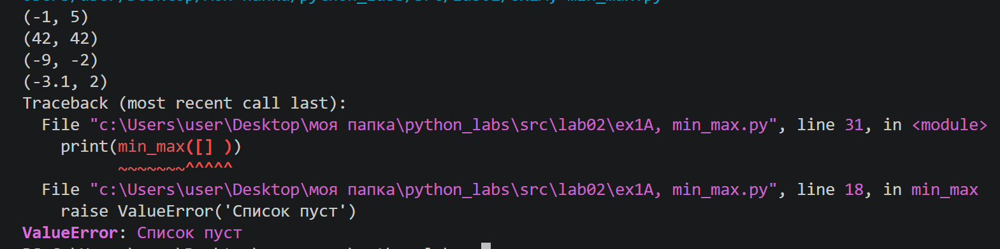
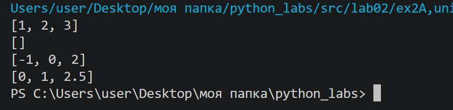
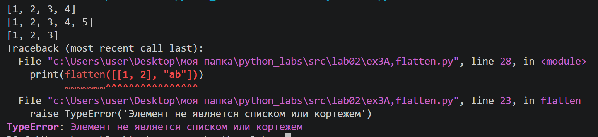
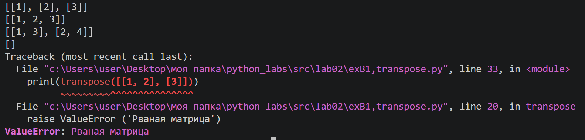
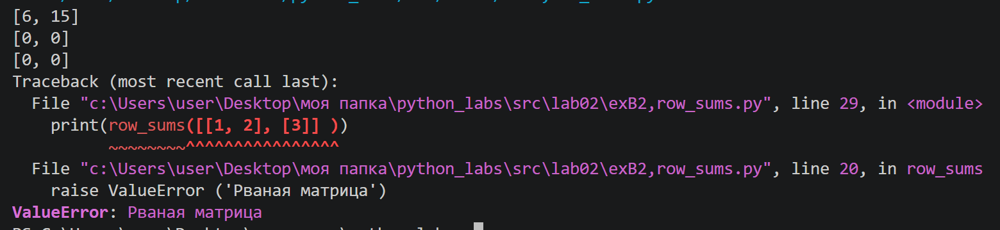
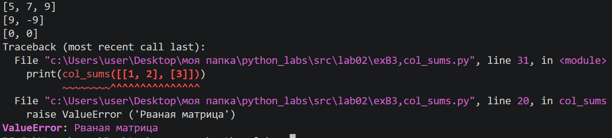
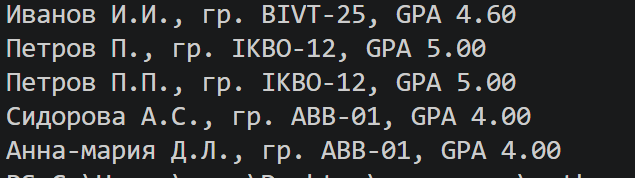

# Лабораторная работа №2
## Задание 1А

Берем первый элемент списка за минимум и максисмум, идем по списку, переприсваиваем до нахождения настоящего максисмума и минимума. Выводим кортеж.

def min_max(nums: list[float | int]) -> tuple[float | int, float | int]:
    
    ''' Вычисляет максимум и минимум списка

    Args: 
        Список чисел (float и int)

    Returns:
        Кортеж (минимум, максимум)

    Raises:
        ValueError:
          'Список пуст'

    '''

    if len(nums)==0:
        raise ValueError('Список пуст')
    minn = nums[0]
    maxx = nums[0]
    for i in nums:
        if i<minn:
            minn= i
        if i > maxx:
            maxx = i
    return (minn, maxx)
print(min_max([3, -1, 5, 5, 0] ))
print(min_max([42] ))
print(min_max([-5, -2, -9]))
print(min_max([1.5, 2, 2.0, -3.1]))
print(min_max([] ))

Вывод:

## Задание 2А

Идем циклом по списку, удаляем дубликаты. Создаем новый список, сравниваем все элементы с нулевым, если находим меньше, добавляем в новый список и удаляем из старого.

def unique_sorted(nums: list[float | int]) -> list[float | int]:

    '''Возвращает уникальный отсортированный (по возрастанию) список

    Args:
        Список чисел (float и int)

    Returns:
        Cписок
    '''

    for i in nums:
        if nums.count(i)>1:
            while nums.count(i)>1:
                nums.remove(i)

    nums1  = []
    while nums:
        m = nums[0]
        for i in nums:
            if i<m:
                m = i
        nums.remove(m)
        nums1.append(m)
    return nums1
print(unique_sorted([3, 1, 2, 1, 3]))
print(unique_sorted([]))
print(unique_sorted([-1, -1, 0, 2, 2]))
print(unique_sorted([1.0, 1, 2.5, 2.5, 0]))

Вывод:

## Задание 3А

Создаем список для результата. Проверяем что элемент списка список или кортеж, идем по нему циклом и добавляем в список результата.

def flatten(mat: list[list | tuple]) -> list:

    '''Переделывает список списков (или кортежей) в один список 

    Args:
        Список списков или кортежей
    
    Returns:
        Список
    
    Raises:
        TypeError: 
            'Элемент не является списком или кортежем'
    '''

    r = []
    for i in mat:
        if type(i)== list or type(i)== tuple:
            for j in i:
                r.append(j)
        else:
            raise TypeError('Элемент не является списком или кортежем')
    return r
print(flatten([[1, 2], [3, 4]] ))
print(flatten([[1, 2], (3, 4, 5)] ))
print(flatten([[1], [], [2, 3]] ))
print(flatten([[1, 2], "ab"]))

Вывод:

## Задание 1В

Проверяем что матрица нерваная. Создаем список для результата. Идем циклом по столбцам и строкам. Меняем местами элементы и добавляем в промежуточный список. В список результата добавляем промежуточный список.

def transpose(mat: list[list[float | int]]) -> list[list]:

    '''Транспонирует матрицу (меняет строки и столбцы местами)

    Args:
        Матрица (список списков)

    Returns:
        Транспонированная матрица

    Raises:
        ValueError: 
            'Рваная матрица'
    '''

    if mat == []:
        return []
    for i in mat:
        if len(i) != len(mat[0]):
            raise ValueError ('Рваная матрица')

    r = []
    for i in range(len(mat[0])):
        r1 = []
        for j in range(len(mat)):
            r1.append(mat[j][i])
        r.append(r1)
    return r
print(transpose([[1, 2, 3]] ))
print(transpose([[1], [2], [3]] ))
print(transpose([[1, 2], [3, 4]] ))
print(transpose([] ))
print(transpose([[1, 2], [3]]))

Вывод:

## Задание 2В

Проверяем что матрица нерваная. Идем циклом по длине. Считаем сумму каждой строки.

def row_sums(mat: list[list[float | int]]) -> list[float]:

    '''Сумма по каждой строке

    Args: 
        Матрица 

    Returns:
        Список сумм 

    Raises:
        ValueError: 
            'Рваная матрица'
    '''
    
    if mat == []:
            return []
    for i in mat:
        if len(i) != len(mat[0]):
            raise ValueError ('Рваная матрица')
    
    r = []
    for i in range (len(mat)):
        r.append(sum(mat[i]))
    return r
print(row_sums([[1, 2, 3], [4, 5, 6]] ))
print(row_sums([[-1, 1], [10, -10]]))
print(row_sums([[0, 0], [0, 0]] ))
print(row_sums([[1, 2], [3]] ))

Вывод:

## Задание 3В

Проверяем что матрица нерваная. Идем циклом по длине матрицы и по колличеству столбцов. Считаем сумму каждого столбца.

def col_sums(mat: list[list[float | int]]) -> list[float]:

    '''Сумма по каждому столбцу

    Args:
        Матрица 

    Returns:
        Список сумм 

    Raises:
        ValueError: 
            'Рваная матрица'
    '''

    if mat == []:
            return []
    for i in mat:
        if len(i) != len(mat[0]):
            raise ValueError ('Рваная матрица')
    r = []
    for i in range(len(mat[0])):
        s = 0
        for j in range(len(mat)):
            s  = s+ mat[j][i]
        r.append(s)
    return r
print(col_sums([[1, 2, 3], [4, 5, 6]] ))
print(col_sums([[-1, 1], [10, -10]] ))
print(col_sums([[0, 0], [0, 0]] ))
print(col_sums([[1, 2], [3]]))

Вывод:

## Задание С

Проверяем всю инвормацию на наличие ошибок. Формируем инициалы. Выводим результат с помощью f стоки.

def format_record(rec: tuple[str, str, float]) -> str:

    '''Функция обрабатывает запись и выводит  ее в виде: 
    Иванов И.И., гр. BIVT-25, GPA 4.60

    Args:
        rec: Кортеж (ФИО, группа, GPA)

    Returns:
        Строку: инициалы, группа, GPA

    Raises:
        TypeError:
            'Запись не являеся кортежем'
            'ФИО записано не как строка'
            'Группа записана не как строка'
            'GPA записоно не как число'
        ValueError:
            'Введены не все элементы'
            'ФИО не введено'
            'Введено неплное ФИО'
            'GPA не соответствует диапазону'
            'ФИО должно состоять только из букв'
            'Группа не введена'
    '''

    if not isinstance(rec, tuple):
        raise TypeError ('Запись не являеся кортежем')
    if len(rec)!=3:
             raise ValueError ('Введены не все элементы')
    if not isinstance(rec[0], str):
                raise TypeError ('ФИО записано не как строка')
    if len(rec[1].strip())==0:
            raise ValueError ('Группа не введена')
    if not isinstance(rec[1], str):
                raise TypeError ('Группа записана не как строка')
    if not isinstance(rec[2], (float, int)):
                raise TypeError ('GPA записоно не как число')
    if len(rec[0].strip().split())==0:
           raise ValueError ('ФИО не введено')
    if len(rec[0].strip().split())!= 3 and len(rec[0].strip().split())!= 2:
               raise ValueError ('Введено неполное ФИО')
    if not(0.0<=rec[2]<=5.0):
         raise ValueError ('GPA не соответствует диапазону')
    

    fio = rec[0].strip().split()
    for j in fio:
            if not j.replace('-','').isalpha():
                  raise ValueError('ФИО должно состоять только из букв')
    surname = fio[0].capitalize()
    name = fio[1]
    group = rec[1]
    gpa = rec[2]
    if len(fio)==3:
        initials = surname + ' ' + name[0].upper() + '.' + fio[2][0].upper() + '.'
    else:
        initials = surname + ' ' + name[0].upper() + '.'
    return (f'{initials}, гр. {group}, GPA {gpa:.2f}')

print(format_record(("Иванов Иван Иванович", "BIVT-25", 4.6) ))
print(format_record(("Петров Пётр", "IKBO-12", 5.0) ))
print(format_record(("Петров Пётр Петрович", "IKBO-12", 5.0) ))
print(format_record(("  сидорова  анна   сергеевна ", "ABB-01", 3.999)))
print(format_record(("  Анна-Мария д-д ллл", "ABB-01", 3.999)))

Вывод:
