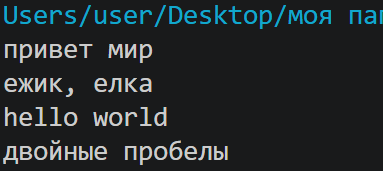
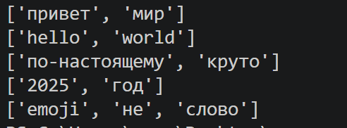
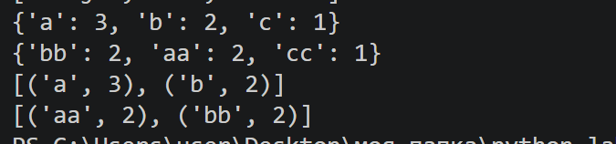
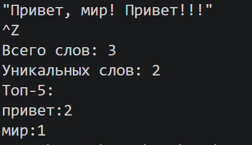
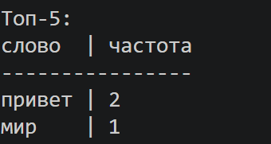

# Лабораторная работа №3

# Задание А— src/lib/text.py

## 1. Функция normalize

Нормализует строку, приводя к нижнему регистру, удаляет лишние пробелы и символы, заменяет ё/Ё на е/Е.

    def normalize(text: str, *, casefold: bool = True, yo2e: bool = True) -> str:

        '''Нормализует текст

        Args:
            text: Исходный текст
            casefold: Перевод букв в строчный вид (True)
            lower: Перевод букв в нижний регистр (False)
            yo2e: Замена ли ё/Ё на е/Е

        Returns:
            text: Обработанный текст
        '''

        if casefold == True:
            text = text.casefold()
        if casefold == False:
            text = text.lower()
        if yo2e== True:
            text = text.replace('ё','е').replace('Ё','Е')
        text = ' '.join(text.split())
        return text
    
**Вывод:**

## 2. Функция tokenize

Разбивает текств на токены с помощью регулярного выражения, оставляя только дефисы.

    import re
    def tokenize(text: str) -> list[str]:

        ''' Разбивает текст в "токены"

        Args:
            text: Исходный текст 

        Returns:
            r: Список слов (токенов)
        '''

        r = []
        for m in re.finditer(r'\w+(-\w+)*',text):
            word = m.group()
            r.append(word)
        return r

**Вывод:**

## 3. Функции count_freq и top_n

Считает сколько раз встретился токен. top_n по умолчанию топ 5, составляет топ встречающихся токенов в тексте.

    def count_freq(tokens: list[str]) -> dict[str, int]:

        '''Считает количество повторений токенов

        Args:
            tokens: Список слов (токенов)

        Returns:
            r: Словарь: слово, количество повторений
        '''

        r = {}
        for i in tokens:
            if i in r:
                r[i] +=1
            else:
                r[i] = 1
        return r

    def top_n(freq: dict[str, int], n: int = 5) -> list[tuple[str, int]]:

        '''Выводит топ  слов по частоте

        Args:
            freq: Словарь: слово, количество повторений
            n: Количество элементов в топе

        Returns:  Список кортежей  (слово, количество повторений)
        '''

        
        return sorted(freq.items(), key = lambda item : (-item[1], item[0]))[:n]

**Вывод:**

# Задание B — Скрипт статистики src/lab03/text_stats.py

## Исходный код src/lab03/text_stats.py

Водится текст и обрабатываеся функциями. На выходе выводится статистика: сколько всего слов, сколько уникальных слов и топ 5 слов по частоте в виде таблицы.

    import sys
    from pathlib import Path
    sys.path.insert(0, str(Path(__file__).resolve().parents[2]))

    from src.lib.text import normalize, tokenize, count_freq, top_n

    flag = 1 # для табличного вывода

    def rez_text():
        text = sys.stdin.read()
        if text.strip() == '':
            raise ValueError('Текст не введен')
        norma = normalize(text)
        token = tokenize(norma)
        cf = count_freq(token)
        top = top_n(cf)
        word = len(token)
        unique = len(set(token))
        print(f'Всего слов: {word}')
        print(f'Уникальных слов: {unique}')
        print(f'Топ-5:')
        if not flag:
            for w,c in top:
                print(f'{w}:{c}')
        else:
            max_len = max(max([len(w) for w, c in top]), len('слово'))
            head = f'{"слово":<{max_len}} | частота'
            print(head)
            print('-' * len(head))
            for w, c in top:
                print(f'{w:<{max_len}} | {c}')

    if __name__ == '__main__':
        rez_text()

## Вывод:
1. **Обычный режим**

2. **Таблица**

